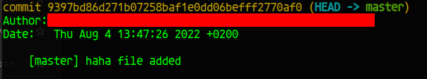

# Commit msg addition

You can add branch name (and really many other things if you tweak the script) to your commit messages by reusing the code from `commit-msg`. If you do not have `commit-msg` already set, you can just copy it to

```code
.git/hooks/
```

assuming that the current directory is the same as your's repo root directory.

Each time you commit you will see such message addition as the example below


